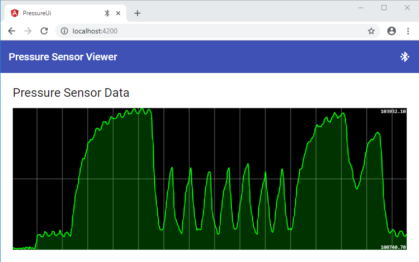

# Smart Bluetooth Air Pressure Sensor

For more info, read [the blog post](https://medium.com/@urish/building-a-smart-air-pressure-sensor-with-espruino-and-angular-942ef7373b92).

## Instructions
You can easily build the device by connecting a [MS5803-14BA Breakout Board](https://www.sparkfun.com/products/12909) with [Espruino Pixl.js](https://http://www.espruino.com/Pixl.js). Then load the [firmware code](firmware/index.js) into the board, start the [Viewer Application](https://pressure-sensor.firebaseapp.com/) and connect to the sensor.

## License
Copyright (C) 2018, Uri Shaked. Released under the MIT license.